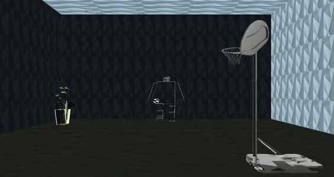
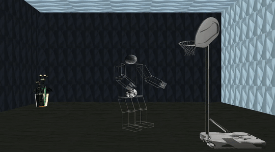
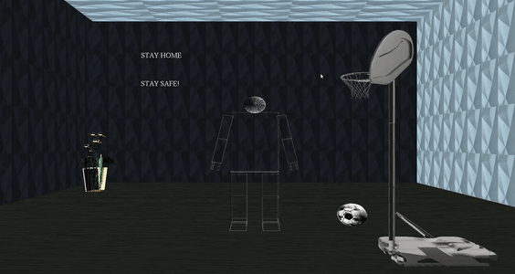

# Texture Mapping, Object Loading and Animation
Created by Team 8
| Name | Sec | BN |
| :---         |     :---:      |     :---:      |
| Tarek Mohamed Rashad :bowtie: | 1 | 43 |
| Mouaz Mohamed Hanfy :bowtie: | 2 | 29 |
| Mahmoud Mohamed Abdelmonem :bowtie: | 2 | 21 |
| Mahmoud Mohamed Ibrahem :bowtie: | 2 | 20 |
| Yehia Mohamed Khalaf :bowtie: | 2 | 48 |

-------------------------------------------------------

# Description (Basket ball player robot) :page_facing_up:
A whole Robot consisting of (shoulder  - elbow - 5 fingers - Femur - Tibia - Feet) with the ability to contract or relax any one of them . Limits are close to the humans movement as possible as i could do, control the camera and the view prospective using the arrows and the mouse, apply the concepts of textures-lightening-and shading, add a drop menu to interact with these texture, import certain objects and implement animations to the robot where one of those animations is to be where the robot interacts with one of the objects. 


# List of Commands
## Commands to generate the compiled file and run it
```
g++ main.cpp imageloader.cpp glm.cpp -o output -lGL -lGLU -lglut -lm
```
```
./output
```
## List of commands to control the body:

----------------------------------------------------
| Element |  |  |
| :---           |     :---:      |     :---:      |
| Body rotation   |       b        |       B        |
| Elbow          |       e        |       E        |
| Fingers        |       g        |       G        |
| Right knee        |     j        |       J        |
| Left Knee        |       h        |       H        |

--------------------------------------------------
### Shoulder Movement

| Shoulder | Button |  | 
| :---                |     :---:      |     :---:      | 
| X-direction         |     q          |      Q         |
| Y-direction         |     a          |      A         |
| Z-direction         |     s          |      S         |
-------------------------------------------------
### Femur Movement

| Right Femur | Button | 
| :---         |     :---:      | 
| Up         |     Y   | 
| Down      |     y      | 
| External        |     u     | 
| Internal        |     U      |
-------------------------------------------------
| Left Femur | Button |
| :---         |     :---:      | 
| Up         |     T   | 
| Down      |     t      | 
| Internal        |      I     | 
| External         |     i      |
-------------------------------------------------
### Camera Movement
| Move | Button |
| :---         |     :---:      | 
| Forward (zoom in)         |     f   | 
| Backward (zoom out)      |     b      | 
| Turn Up        |     up key      | 
| Turn Down         |     down key      |
| Turn Right         |     right key     |
| Turn Left         |     left key     |  
----------------------------------------------------
## Animations' Controls

| Animation type | Button | 
| :---         |     :---:      | 
| to command the robot to make a 3 point basketball shot |  z  | 
| to command the robot to wave to the public |  v  | 

----------------------------------------------------------------
----------------------------------------------------------------
# Animation Scenes with its functions 


This function makes the 1st animation in which the robot moves along the room.
```
void timer(int)
```


--------------------------------------------------------------

This function makes the 2nd animation in which the robot throw the basketball in the basketball hoop by pressing "z" key.
```
void timerica(int)
```


---------------------------------------------------------------

This fuction makes the 3rd animation in which the robot waves his hand and displays a message by pressing "v" key.
```
void timer3(int)
```


---------------------------------------------------------------
---------------------------------------------------------------

## Problems 
- First issue was working on codeblocks on windows, it wasn't applicable to add texture mapping on it, the same for adding objects, it wasn't applicable at all "the solution was working on ubuntu instead of windows".
- An error while compiling the code ( ISO C++ forbids converting a string constant to 'char*' -----) "solution was running all the cpp files and making sure that the written command was right as refered in Commands to generate the compiled file section above.
- At first the texture mapping wasn't appeared, it is obtained the reason for that (bind) wasn't applied.

---------------------------------------------------------------
## contributions

- .bmp image converter [https://image.online-convert.com/convert-to-bmp]
-  objects website [http://www.sweethome3d.com/freeModels.jsp]