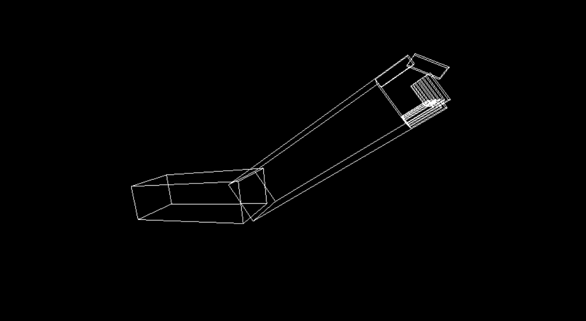

# Assignment 1:Robotic Arm
## _Name: Tarek Mohamed Rashad :bowtie: , Sec: 1 , BN: 43_

## Description :page_facing_up:
A Robotic arm consisting of (shoulder  - elbow - 5 fingers) with the ability to contract or relax any one of them . Limits are close to the humans movement as possible as i can do :sweat_smile:

#### Order of the process :clipboard:
1. A cube of dimensions 1×1×1 is drawn 
2. The cube is translated to the required position 
3. The cube is scaled with different dimensions to draw the required size of the element
4. The element is rotated ( contracted and relaxed ) due to condition of movement's limit

## Code :link: : [https://github.com/sbme-tutorials/assignment-1-robot-arm-Tarek999/blob/master/Source.cpp] :innocent:

## Problems 
- A weird movement of fingers :shit: ( solution: The order of my code was not correct because i wrote the code of all fingers'bases then fingers'flangs "so i re-ordered my code and every finger base is followed by it's flang " with putting them between push and pop matrices )
- The movement of 4 fingers'flangs were around the center point of flangs so it leaves gap when it rotates ( solution: modifying the translation coofficients to make the rotation aroung the contact point between base and flang)
- overlapping of finger's flangs ( solution: "modifying the limit's angles of flanges" )

## Movement buttons 

| Element | Contraction | Relaxtion |
| :---         |     :---:      |     :---:      |
| Shoulder | s | S |
| Elbow | e | E |
| Thumb finger | F | f |
| Index finger | g | G |
| Middle finger | h | H |
| Ring finger | j | J |
| Little finger | k | K |

Note: Finger bases are not moving so i didn't mention buttons for their movement  

## contributions

The helping code of Assignment [https://github.com/sbme-tutorials/SBE306-Computer-Graphics-Tutorials/blob/master/Tutorial-02/arm.c]

