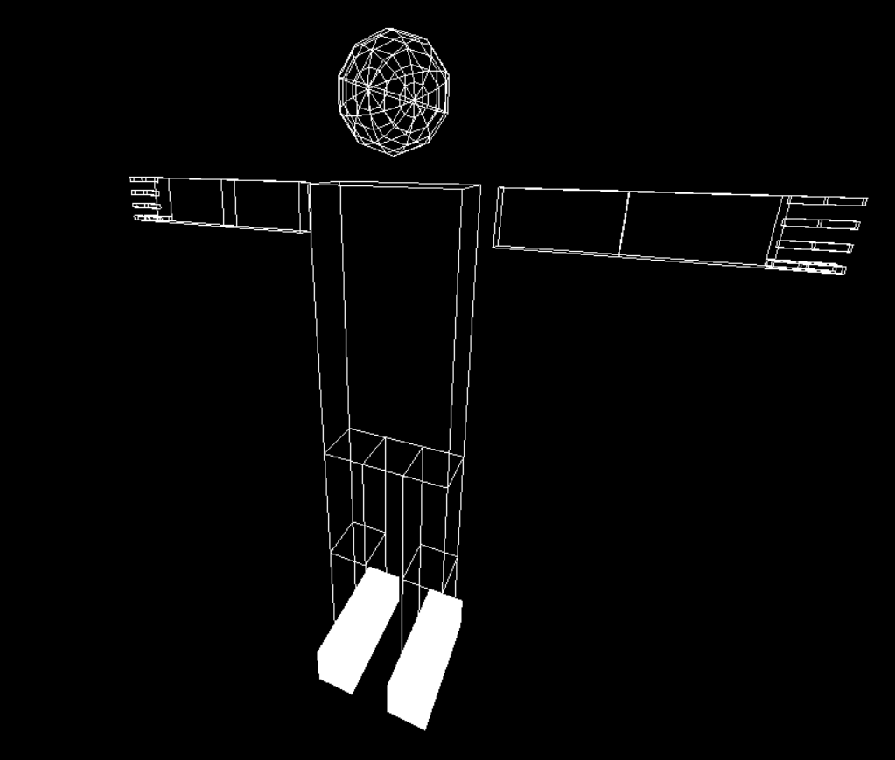
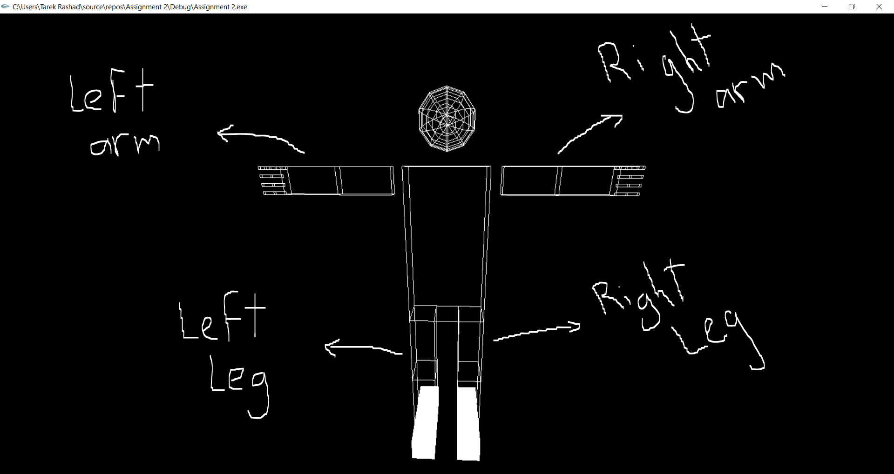

# Assignment 2: Robotic Arm
Created by Team 8
| Name | Sec | BN |
| :---         |     :---:      |     :---:      |
| Tarek Mohamed Rashad :bowtie: | 1 | 43 |
| Mouaz Mohamed Hanfy :bowtie: | 2 | 29 |
| Mahmoud Mohamed Abdelmonem :bowtie: | 2 | 21 |
| Mahmoud Mohamed Ibrahem :bowtie: | 2 | 20 |
| Yehia Mohamed Khalaf :bowtie: | 2 | 48 |
----------------------------------------------------------------------------

----------------------------------------------------------------------------
## Description :page_facing_up:
A whole Robot consisting of (shoulder  - elbow - 5 fingers - Femur - Tibia - Feet) with the ability to contract or relax any one of them . Limits are close to the humans movement as possible as i can do :sweat_smile:

#### Order of the process :clipboard:
1. A cube of dimensions 1×1×1 is drawn 
2. The cube is scaled with different dimensions to draw the required size of the element
3. The element is rotated ( contracted and relaxed ) due to condition of movement's limit
4. The cube is translated to the required position 
5. Camera Movements 

## Code :link: : [https://github.com/sbme-tutorials/sbe306spring2021assignment2-team08/blob/master/Source.cpp] :innocent:

## Problems 
- Determining positions of push and pop matrices in the code.
- The finger wasn't rotating as the supposed position when i tapped the key at first and it needed to be rotated 2 cycles then it is translated to the right position. ("A missing pop matrix in the code") ( it took from me more than half an hour to figure that :laughing:)
- The body was translated to a different position when we move it forward and backward (" we forgot to write glutPostRedisplay(); after calling the function") 

## Movement buttons 
Notes: 
- Finger bases are not moving so i didn't mention buttons for their movement.
- At Start : The Body representation is as shown below

| Element | Contraction | Relaxation |
| :---         |     :---:      |     :---:      |
| Elbow | e | E |
| Right Thumb finger | F | f |
| Left Thumb finger | G | g |
| Right fingers | z | Z |
| Left fingers | x | X |
| Right Tibia | U | u |
| Left Tibia | W | w |
--------------------------------------------------
### Shoulder Movement

| Shoulder | Button | 
| :---         |     :---:      | 
| Up         |     s   | 
| Down      |     S      | 
| Forward         |     d      | 
| Backward         |     D      | 
| Rotation up        |     r      | 
| Rotation Down        |     R      | 
-------------------------------------------------
### Femur Movement

| Right Femur | Button | 
| :---         |     :---:      | 
| Up         |     y   | 
| Down      |     Y      | 
| External        |     H     | 
| Internal        |     h      |
-------------------------------------------------
| Left Femur | Button |
| :---         |     :---:      | 
| Up         |     o   | 
| Down      |     O      | 
| Internal        |     a      | 
| External         |     A      |
-------------------------------------------------
### Camera Movement
| Move | Button |
| :---         |     :---:      | 
| Forward (zoom in)         |     q   | 
| Backward (zoom out)      |     Q      | 
| Turn Up        |     up key      | 
| Turn Down         |     down key      |
| Turn Right         |     right key     |
| Turn Left         |     left key     |  

## contributions

- The helping code of Assignment [https://github.com/sbme-tutorials/SBE306-Computer-Graphics-Tutorials/blob/master/Tutorial-02/arm.c]

